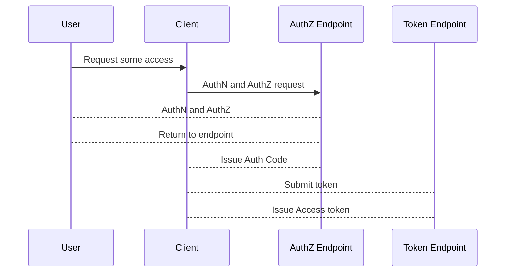

RFC 6749
https://tools.ietf.org/html/rfc6749#section-4.1

App asks user to Client asks user to li
Client request authorization

Redirect user to auth/consent

Auth server returns authorization code

| Endpoint        | Auth Code | Access Token | ID Token |
| Authorization | Issued        |  X                   |   X           |
| Token             |    X              |  Issued          |   Issued    |

also issue  ID token if in scope
